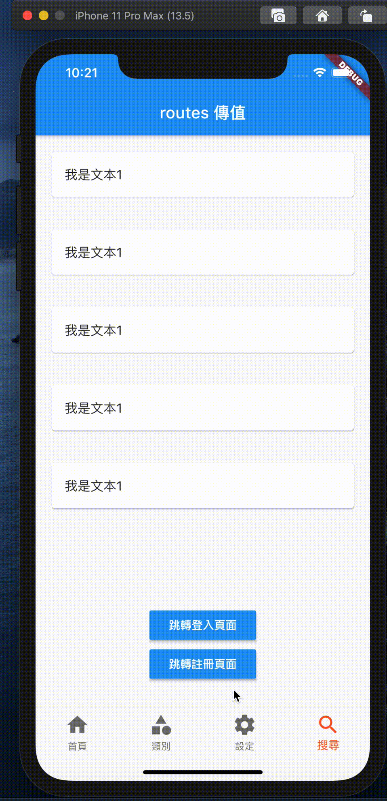

## main_dart
 

##  User Package 頁面跳轉返回重繪與,返回根頁面
Navigator.of(context).pushAndRemoveUntil (頁面重繪,實現跳轉效果)
 
返回根頁面
 
Navigator.of(context).pushAndRemoveUntil(
 
new MaterialPageRoute(builder: (context)=> new TabPage(參數)),
 
(route) => route  == null);
 

 
